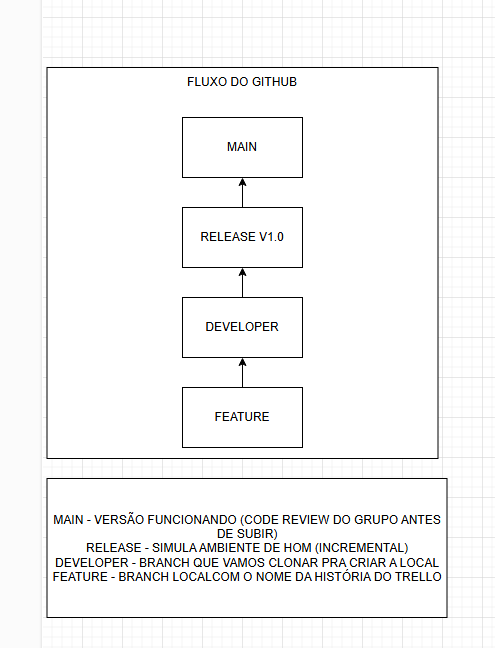

# Embrapa API

## Índice
- [Fluxo do GitHub](#fluxo-do-github)
- [Arquitetura do Projeto](#arquitetura-do-projeto)
- [Estrutura do Projeto](#estrutura-do-projeto)
- [Instalação](#instalação)
- [Uso](#uso)

- [Licença](#licença)

## Fluxo do GitHub


## Arquitetura do Projeto
O projeto segue a arquitetura Hexagonal / Clean Architecture.

## Estrutura do Projeto

```
/embrapa_api
├── /src
│   ├── /domain                  # Domínio puro
│   │   ├── entities.py          # Entidades (Producao, Vinho)
│   │   ├── ports.py             # Interfaces (IScraperPort, IRepository)
│   ├── /application             # Regras de negócio
│   │   ├── use_cases.py         # ObterProducaoUseCase
│   ├── /adapters                # Implementações concretas
│   │   ├── scraper.py           # EmbrapaScraperAdapter
│   │   ├── repository.py        # PostgreSQLRepository
│   ├── /api                     # Camada de entrada (HTTP)
│   │   ├── controllers.py       # FastAPIController
│   │   ├── dependencies.py      # Injeção de dependências
│   ├── config.py                # Configurações (DB, Redis)
├── /tests
├── main.py                      # Ponto de entrada
├── requirements.txt
```

## Instalação
Para instalar as dependências do projeto, execute:
```bash
    pip install -r requirements.txt
```
## Uso
Para iniciar a aplicação, execute o arquivo `main.py`:
```bash
    python main.py
```
A aplicação estará disponível em `http://localhost:8000`.

## Licença 
Este projeto é licenciado sob a Licença MIT. Veja o arquivo [LICENSE](LICENSE) para mais detalhes.
