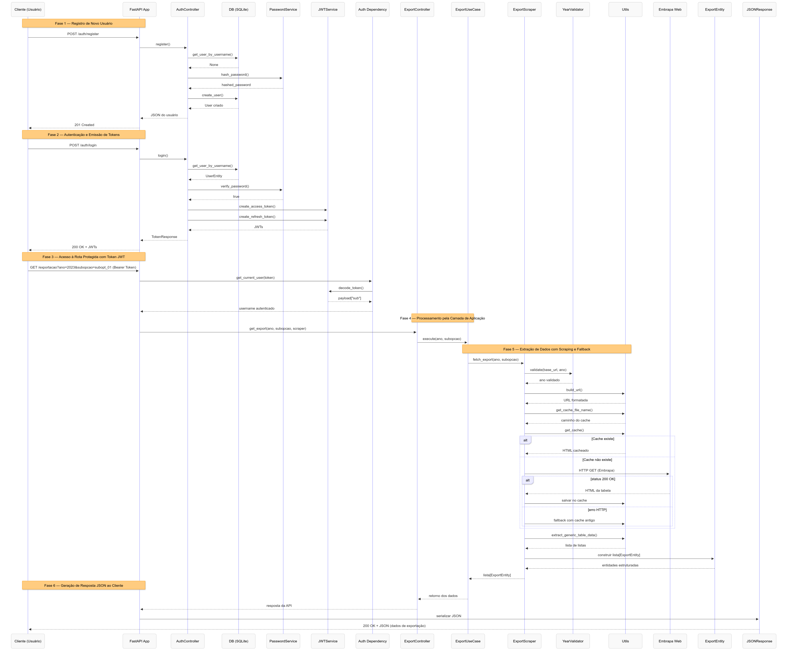
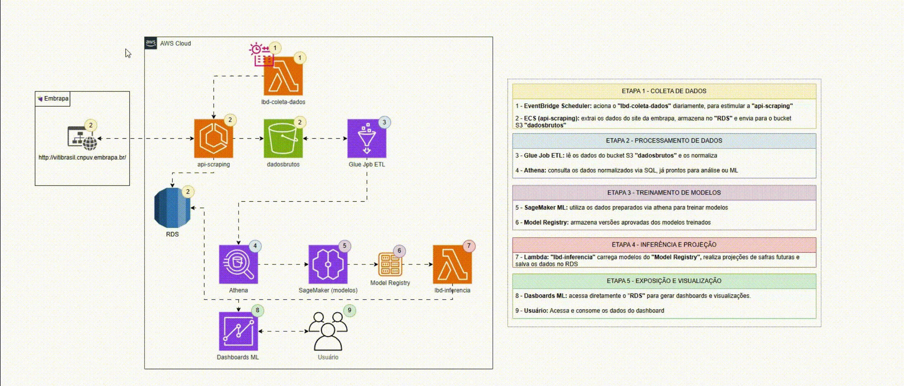

<h1 align="center">🍇 Embrapa Data API</h1>
<p align="center">
  Uma API RESTful moderna e estruturada em <strong>Python 3.11 + FastAPI</strong> para expor dados públicos da vitivinicultura brasileira, com arquitetura limpa, testes automatizados e scraping de dados diretamente do site da <a href="http://vitibrasil.cnpuv.embrapa.br/">Embrapa</a>.
</p>

<p align="center">
  
  
  
  
</p>

---

## 📌 Índice

- [📝 Sobre o Projeto](#-sobre-o-projeto)
- [🛠 Tecnologias Utilizadas](#-tecnologias-utilizadas)
- [🧱 Arquitetura](#-arquitetura)
- [🖼️ Diagramas](#-diagramas)
- [🔐 Autenticação](#-autenticação)
- [🔗 Rotas da API](#-rotas-da-api)
- [🧠 Mecanismo de Cache (Fallback)](#-mecanismo-de-cache-fallback)
- [💾 Banco de Dados](#-banco-de-dados)
- [🚀 Como Usar](#-como-usar)
- [✅ Execução dos Testes](#-execução-dos-testes)
- [⚙️ Integração Contínua (CI) com GitHub Actions](#-integração-contínua-ci-com-github-actions)
- [🏠 Repositorio do Github](#-repositorio-do-github)
- [☁️ Hospedagem da API](#-hospedagem-da-api)
- [🎥 Vídeo Demonstração](#-vídeo-demonstração)
- [📜 Licença](#-licença)

---

## 📝 Sobre o Projeto

Este projeto expõe uma **API RESTful** para facilitar o acesso aos dados de vitivinicultura pública brasileira do site da [Embrapa Vitibrasil](http://vitibrasil.cnpuv.embrapa.br/).  
Esses dados, originalmente disponíveis em páginas HTML como tabelas, são **extraídos via web scraping** e organizados para fácil consumo por sistemas e usuários técnicos.

Os dados disponíveis envolvem informações sobre:

- Produção
- Processamento
- Importação
- Exportação
- Comercialização

---

## 🛠 Tecnologias Utilizadas
- **Python 3.11**
- **FastAPI**
- **BeautifulSoup4**
- **Uvicorn**
- **Pytest**
- **GitHub Actions**
- **Ruff**
- **Bandit**
- **Safety**

---

## 🧱 Arquitetura

A aplicação é baseada nos princípios da **Clean Architecture** (hexagonal), dividindo responsabilidades entre:


### 🗂️ Descrição Geral das Pastas

| 📁 Pasta                         | ✨ Descrição                                                                   |
|----------------------------------|-------------------------------------------------------------------------------|
| `.github/`                       | Contém configurações de CI com GitHub Actions                                 |
| `src/app/`                       | Contém o `main.py`, responsável por inicializar o servidor FastAPI            |
| `src/app/adapter/scraper`        | Responsável pela extração e scraping dos dados da Embrapa                     |
| `src/app/api/controllers/`       | Define as rotas públicas que a API disponibiliza                              |
| `src/app/api/dependencies/`      | Define as dependências injetadas nas rotas da API                             |
| `src/app/api/docs/`              | Exemplos de queries para a documentação Swagger                               |
| `src/app/api/schemas/`           | Define os modelos de dados utilizados nas requisições e respostas da API      |
| `src/app/application/service/`   | Contém serviços que implementam regras de negócio                             |
| `src/app/application/usecase/`   | Lógica de negócio que consome os dados extraídos e prepara a resposta final   |
| `src/app/application/validator/` | Validações de entrada, como ano e parâmetros de navegação                     |
| `src/app/cache/`                 | Implementa o mecanismo de cache para fallback                                 |
| `src/app/config/params`          | Configurações e constantes                                                    |
| `src/app/domain/entities`        | Contém as entidades                                                           |
| `src/app/domain/enums`           | Contém os enums                                                               |
| `src/app/domain/ports`           | Contém as interfaces                                                          |
| `src/app/exceptions/`            | Exceções customizadas para padronizar erros retornados pela API               |
| `src/app/infrastructure/db/`     | Configurações e modelos de banco de dados                                     |
| `src/app/infrastructure/docs/`   | Documentação adicional para a infraestrutura                                  |
| `src/app/util/utils`             | Utilitários e formatadores utilizados em múltiplas partes do sistema          |
| `src/tests/`                     | Testes unitários organizados por camada (com uso de mocks)                    |
| `requirements.txt`               | Lista de dependências da aplicação para instalação                            |
| `pytest.ini`                     | Configurações globais para rodar o Pytest                                     |
---

## 🖼️ Diagramas

### Diagrama de sequência: AS-IS


### Descrição do Diagrama de sequência: AS-IS

Fase 1: **Registro de Usuário**
- O cliente registra um novo usuário. O sistema verifica duplicidade, hasheia a senha e cria o usuário no banco.

Fase 2: **Autenticação**
-  O cliente realiza login, a senha é validada e o sistema emite tokens JWT para acesso.

Fase 3: **Acesso Protegido**
-  O cliente acessa rota protegida enviando token JWT, que é validado para liberar acesso.

Fase 4: **Processamento da Requisição**
-  O controller encaminha a solicitação à camada de aplicação para execução da lógica.

Fase 5: **Extração de Dados**
-  O scraper obtém dados do site, usando cache quando possível, e converte em entidades estruturadas.

Fase 6: **Resposta ao Cliente**
-  Os dados extraídos são retornados ao cliente em formato JSON via API.


### Desenho de arquitetura: TO-BE



## 🔐 Autenticação

A API utiliza autenticação JWT (Bearer Token). Para acessar as rotas protegidas:

1. **Registre um usuário**:
```
POST /embrapa-vitivinicultura/auth/register
```
   
```json 
{
  "username": "seu_usuario",
  "password": "sua_senha",
  "email": "seu@email.com"
}
```

2. **Faça login para obter o token**:
```
POST /embrapa-vitivinicultura/auth/login
```
   
```json 
{
  "username": "seu_usuario",
  "password": "sua_senha"
}
```

3. **Use o token nas requisições**:
```
Authorization: Bearer <seu_token>
```


## 🔗 Rotas da API

Todas as rotas de dados são protegidas e requerem autenticação JWT.

### 🌐 Rotas Públicas

| Método | Endpoint  | Descrição                           |
|--------|-----------|-------------------------------------|
| `GET`  | `/`       | Rota raiz com as informações da API |
| `GET`  | `/health` | Verificação do status da API        |

### 🔒 Rotas Protegidas (requerem autenticação)

| Método | Endpoint                                            | Descrição                           |
|--------|-----------------------------------------------------|-------------------------------------|
| `GET`  | `/embrapa-vitivinicultura/producao`                 | Retorna dados de produção           |
| `GET`  | `/embrapa-vitivinicultura/processamento`            | Retorna dados de processamento      |
| `GET`  | `/embrapa-vitivinicultura/importacao`               | Retorna dados de importação         |
| `GET`  | `/embrapa-vitivinicultura/exportacao`               | Retorna dados de exportação         |
| `GET`  | `/embrapa-vitivinicultura/comercializacao`          | Retorna dados de comercialização    |

### 🔎 Query Parameters

As rotas de dados aceitam os seguintes parâmetros de consulta:

| Parâmetro  | Obrigatório     | Descrição                                                                 |
|------------|-----------------|---------------------------------------------------------------------------|
| `ano`      | Sim             | Ano específico para filtrar os dados (ex: `?ano=2022`)                    |
| `subopcao` | Depende da rota | Subopção específica para detalhamento dos dados (ex: `?subopcao=subopt_01`) |

---

### 📂 Subopções disponíveis por rota:

| Rota                | Subopção    | Descrição                         |
|---------------------|-------------|-----------------------------------|
| **Processamento**   | `subopt_01` | Viníferas                         |
|                     | `subopt_02` | Americanas e híbridas             |
|                     | `subopt_03` | Uvas de mesa                      |
|                     | `subopt_04` | Sem classificação                 |
| **Importação**      | `subopt_01` | Vinhos de mesa                    |
|                     | `subopt_02` | Espumantes                        |
|                     | `subopt_03` | Uvas frescas                      |
|                     | `subopt_04` | Uvas passas                       |
|                     | `subopt_05` | Suco de uva                       |
| **Exportação**      | `subopt_01` | Vinhos de mesa                    |
|                     | `subopt_02` | Espumantes                        |
|                     | `subopt_03` | Uvas frescas                      |
|                     | `subopt_04` | Suco de uva                       |


📘 Acesse a documentação interativa em:  
[http://localhost:8000/docs](http://localhost:8000/docs)

---

### 🧠 Mecanismo de Cache (Fallback)

Para garantir maior **resiliência** e **desempenho** durante a extração dos dados do site da Embrapa, a aplicação utiliza um mecanismo de **cache local com fallback automático**.

### 🔁 Como Funciona:

Ao fazer uma requisição de scraping para obter os dados:

1. A aplicação primeiro **verifica se existe um cache local** correspondente à URL da requisição.
2. Se **não houver cache**, ela realiza a **requisição HTTP normalmente** e **salva uma cópia do HTML** em disco.
3. Caso ocorra qualquer erro durante a requisição (como timeout, indisponibilidade do site ou exceções de rede), o sistema tenta **utilizar o HTML previamente armazenado no cache** como **fallback**.
4. Se nem a requisição nem o cache estiverem disponíveis, uma exceção personalizada (`DataFetchError`) é lançada.

### ✅ Benefícios:

- **Alta disponibilidade**, mesmo com instabilidades no site da Embrapa.
- **Redução de latência** em execuções repetidas.
- **Menor carga no site fonte** (Embrapa Vitibrasil), evitando bloqueios ou throttling.

### 📁 Onde o cache é armazenado?

Os arquivos HTML cacheados são salvos com nomes derivados da URL de origem, usando hashing ou sanitização de nome, dentro de uma pasta local (`/cache`).

---

## 💾 Banco de Dados
A aplicação utiliza um banco de dados SQLite para armazenar os dados extraídos. O banco é inicializado automaticamente ao iniciar a aplicação, criando as tabelas necessárias.

---

## 🚀 Como Usar

### 1. Clonar o repositório

```bash
  git clone https://github.com/PauloGuedes2/embrapa-api.git
  cd embrapa-api
```

### 2. Criar ambiente virtual

```bash
  python -m venv venv
  source venv/bin/activate  # Windows: venv\Scripts\activate
```

### 3. Instalar dependências

```bash
  pip install -r requirements.txt
```

### 4. Configurar variáveis de ambiente
Crie um arquivo `.env` na raiz do projeto com as seguintes variáveis:

```dotenv
DATABASE_URL=sqlite:///./app.db
JWT_SECRET_KEY=sua_chave_secreta
JWT_ALGORITHM=HS256
JWT_EXPIRE_MINUTES=30
```

### 5. Rodar localmente
```bash
  uvicorn src.app.main:app --reload
```
### OU
```bash
  python -m src.app.main
```

---
## ✅ Execução dos Testes

### A aplicação possui testes unitários utilizando pytest.
```bash
  pytest
```

### Para rodar os testes com cobertura, utilize:
```bash
  pytest --cov=src/
```
---

## ⚙️ Integração Contínua (CI) com GitHub Actions

Este projeto já está integrado com uma pipeline de CI utilizando GitHub Actions, que executa as seguintes validações automaticamente a cada push ou pull request na branch main:

### Validações Realizadas:

| Ferramenta | Finalidade                                       |
|--------|--------------------------------------------------|
| `Ruff`  | `Análise estática e linting de código Python`    |
| `Bandit`  | `Verificação de falhas de segurança no código`   |
| `Safety`  | `Validação de vulnerabilidades nas dependências` |
| `Coverage`  | `Verificação de cobertura de testes com pytest`  |

### Arquivo da pipeline:

```yaml
.github/workflows/python_ci.yml
```

---

## 🏠 Repositorio do Github

- **Link do repositório:** https://github.com/PauloGuedes2/embrapa-api

---

## ☁️ Hospedagem da API
A API está hospedada no Render, uma plataforma de nuvem que permite implantar aplicativos web facilmente. Você pode acessar a API através do seguinte link:

- **Link da API (Swagger):** https://embrapa-api-1.onrender.com/docs
- **Link da API (rota raiz):** https://embrapa-api-1.onrender.com/
- **Link da API (health):** https://embrapa-api-1.onrender.com/health

## 🎥 Vídeo Demonstração

- **Confira o vídeo de demonstração do projeto no YouTube:** https://www.youtube.com/watch?v=97KAbD9-3PY&ab_channel=VitorBrand%C3%A3o
- **Confira o vídeo de demonstração do projeto no Google Drive:** https://drive.google.com/file/d/1FcKSMmnAs7FTBTJb7MQiZ7X54aXUq9sv/view

---

## 📜 Licença
Este projeto está licenciado sob a Licença MIT. Veja o arquivo [LICENSE](LICENSE) para mais detalhes.
